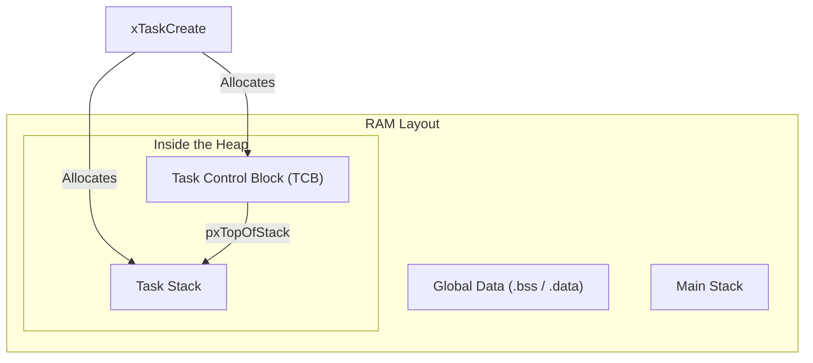
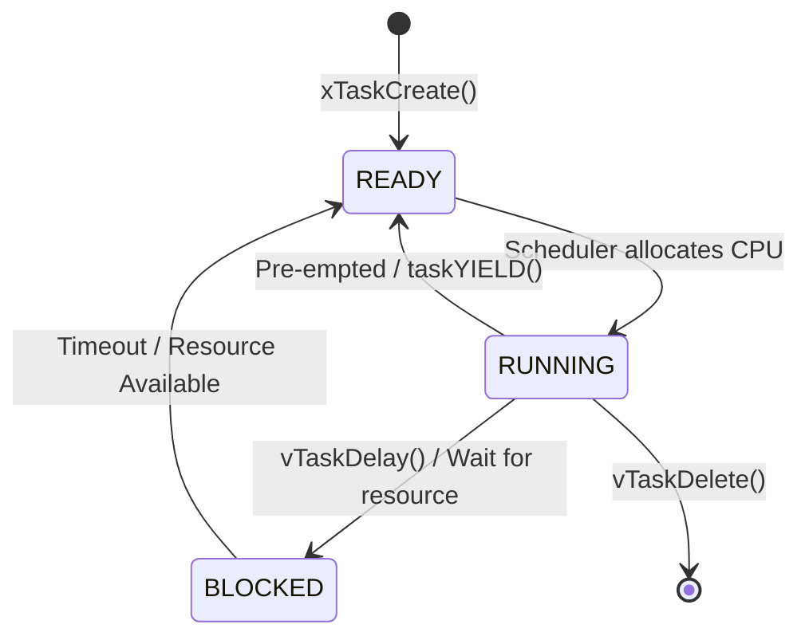

# FreeRTOS Task Creation - Detailed Guide

## 1. What is a Task?
In a bare-metal embedded system (without an OS), your code typically runs in a single large infinite loop (the "Super Loop"). In FreeRTOS, the application is divided into independent chunks of code called **Tasks**.
A Task is simply a C function that can be scheduled to run on the CPU. Each task behaves as if it has the entire CPU to itself.

### The Anatomy of a Task
A task function in FreeRTOS must have a specific signature: it returns `void` and takes a single `void *` parameter.

```c
void vTaskFunction( void *pvParameters )
{
    /* Task initialization code goes here */

    for( ;; ) /* Infinite loop */
    {
        /* Task application code goes here */
    }
}
```

## 2. Creating and Implementing a Task
Creating a task involves two steps: calling the FreeRTOS API to register the task, and writing the C function that implements it.

### A. Creating the Task: `xTaskCreate()`
To create a task, you use the `xTaskCreate()` API function.

```c
#include "FreeRTOS.h"
#include "task.h"

// Task handles
TaskHandle_t xTask1Handle = NULL;

int main(void)
{
    // Create Task 1
    xTaskCreate(
        vTask1_handler,       /* Pointer to the function that implements the task */
        "Task-1",             /* Text name for the task (useful for debugging) */
        configMINIMAL_STACK_SIZE, /* Stack size in words (not bytes!) */
        NULL,                 /* Parameter passed into the task */
        2,                    /* Priority at which the task is created */
        &xTask1Handle         /* Pointer to store the task handle */
    );

    // Start the scheduler so the tasks start executing
    vTaskStartScheduler();

    // The code should never reach here unless there is insufficient RAM
    for(;;);
}
```

### B. Implementing the Task Handler
**Key Rules:**
1. **Infinite Loop**: A task usually runs forever, performing its duty periodically or reacting to events.
2. **Never Return**: A task function must never execute a `return` statement or reach the end of its closing bracket `}`.
3. **Deleting**: If a task is only meant to run once, it must delete itself using `vTaskDelete(NULL)`.

```c
void vTask1_handler(void *pvParameters)
{
    // Initialization (runs once when the task starts)
    int counter = 0;

    // The Task Loop
    while(1)
    {
        // Do something
        counter++;
        
        // Wait for 1000 ticks (Blocking state)
        vTaskDelay(pdMS_TO_TICKS(1000)); 
    }
    
    // A task MUST NOT return. If we break out of the loop, we must delete it.
    vTaskDelete(NULL); 
}
```

## 3. Task Priorities
When multiple tasks are ready to run, the CPU can only execute one at a time. The **Scheduler** decides which one runs based on **Priority**.
- **Lower Priority Number = Lower Urgency**: Priority 0 is the lowest (typically given to the Idle task).
- **Higher Priority Number = Higher Urgency**: The maximum priority is `(configMAX_PRIORITIES - 1)`.

**Memory Impact**: You configure `configMAX_PRIORITIES` in `FreeRTOSConfig.h`.
```c
#define configMAX_PRIORITIES  ( 5 ) // Priorities 0, 1, 2, 3, 4 are available
```
*Note: Using too many priority levels wastes RAM, as FreeRTOS maintains a separate "Ready List" for each priority level. It can also degrade performance due to excessive context switching if not designed carefully.*

## 4. Under the Hood: Task Control Block (TCB) and Memory Layout
To truly master FreeRTOS, you must understand how it manages memory and what happens under the hood when a task is created. 

### A. The Memory Layout
When you run a FreeRTOS application on a microcontroller (e.g., with 128KB SRAM), the RAM is divided into specific regions:

1. **Global Data (`.data` and `.bss`)**: This is where all global and `static` variables live. Their size is fixed at compile time.
2. **Main Stack (MSP)**: Used by the main C program (`main()`), hardware interrupts (ISRs), and the FreeRTOS kernel itself.
3. **The FreeRTOS Heap**: A large block of memory (size defined by `configTOTAL_HEAP_SIZE`) reserved specifically for FreeRTOS to allocate memory dynamically.

When you call `xTaskCreate()`, FreeRTOS uses `pvPortMalloc()` to grab two chunks of memory from the **Heap**:
- **The Task Stack**: A dedicated stack just for this task.
- **The TCB (Task Control Block)**: A structure that holds the task's metadata.



### B. What is stored on the Task Stack?
Each task gets its own stack memory. When the task is running, this stack is tracked by the processor's Process Stack Pointer (PSP). The task stack stores:
- **Local Variables**: Any non-static variables declared inside the task function.
- **Function Call Context**: Return addresses and arguments when the task calls other functions.
- **CPU Registers (Context Saving)**: When the Scheduler interrupts the task to run another one (Context Switch), it takes all the CPU core registers (R0-R15, PSR, etc.) and pushes them onto this Task Stack. When the task resumes, the registers are popped back off.

### C. Deep Dive into the TCB (`tskTaskControlBlock`)
The TCB is the "ID Card" of a task. The FreeRTOS kernel uses the TCB to track everything about a task. If you look inside `tasks.c`, the `TCB_t` structure looks roughly like this (simplified):

```c
typedef struct tskTaskControlBlock
{
    volatile StackType_t *pxTopOfStack; /* MUST BE THE FIRST ELEMENT! Points to the last item pushed to the task's stack. */

    ListItem_t xStateListItem;          /* The list item used to place the TCB in Ready/Blocked/Suspended lists. */
    ListItem_t xEventListItem;          /* The list item used to place the TCB in Event lists (e.g., waiting for a Queue). */
    UBaseType_t uxPriority;             /* The priority of the task. */
    StackType_t *pxStack;               /* Points to the start of the stack (used to check for Stack Overflows). */
    char pcTaskName[ configMAX_TASK_NAME_LEN ]; /* Descriptive name given during creation. */
    
    // ... other members depending on FreeRTOSConfig.h (e.g., Mutex tracking, Thread Local Storage)
} tskTCB;
```

**Key TCB Members Explained:**
1. **`pxTopOfStack`**: This **must** be the very first member of the struct. During a context switch, the assembly code needs to know exactly where the task's stack pointer was saved to restore the CPU registers. By placing it first, it sits at offset `0` of the TCB memory address, allowing the fastest possible assembly execution.
2. **`xStateListItem`**: FreeRTOS manages tasks using Doubly Linked Lists (e.g., `pxReadyTasksLists`, `pxDelayedTaskList`). This list item is the "node" that allows the TCB to be chained into these lists depending on its state.
3. **`pxStack`**: While `pxTopOfStack` moves up and down as the task runs, `pxStack` always points to the base of the allocated stack memory. FreeRTOS uses this to detect if the task has written past its stack boundary (Stack Overflow).

## 5. Scheduling
The **Scheduler** is the core of FreeRTOS. It is a piece of code that runs in privileged mode, deciding which task in the "Ready List" gets CPU time.



- Tasks are created in the **READY** state.
- You must call `vTaskStartScheduler()` to transfer control from `main()` to the RTOS.

### Scheduling Policies
Controlled by `configUSE_PREEMPTION` in `FreeRTOSConfig.h`.

#### A. Pre-emptive Scheduling (`configUSE_PREEMPTION = 1`)
**Pre-emption** means replacing a running task with another task involuntarily.

- **Priority-based Pre-emption**: A higher-priority task will immediately preempt a lower-priority task the moment the higher-priority task becomes READY. The lower-priority task is forced back to the READY state.

```mermaid
gantt
    title Priority-based Pre-emption Simulation
    dateFormat  s
    axisFormat  %S
    
    section Task 2 (Low Prio)
    Running           :active, t2_1, 0, 2s
    Pre-empted (Ready):crit, t2_2, 2, 3s
    Running           :active, t2_3, 5, 2s

    section Task 1 (High Prio)
    Blocked (Delay)   :done, t1_1, 0, 2s
    Running (Preempts):active, t1_2, 2, 3s
    Blocked (Delay)   :done, t1_3, 5, 2s
```



- **Round-Robin (Time Slicing)**: If two tasks share the *same* priority, the CPU time is divided into equal "Time Slices" (Tick interrupts). They take turns executing cyclically.


#### B. Co-operative Scheduling (`configUSE_PREEMPTION = 0`)
The scheduler will **never** interrupt a running task to swap it out. The running task has total control of the CPU until it explicitly yields.
- A task yields by calling blocking functions like `vTaskDelay()`, `xQueueReceive()`, or explicitly giving up the CPU via `taskYIELD()`.
- The RTOS tick interrupt still fires to track time, but it won't force a context switch.

## 6. Printf over SWO Pin (ITM)
Using standard UART for `printf` inside an RTOS can cause massive delays and bugs because standard `printf` is slow and blocks the CPU.
Instead, ARM Cortex processors feature the **ITM (Instrumentation Trace Macrocell)**. You can route `printf` through the SWO (Serial Wire Output) pin. It is highly optimized, application-driven, and supports tracing operating system events with minimal overhead.

## 7. Deep Dive Q&A (Multiple Choice)

**Q1: If you dynamically create a FreeRTOS Task with 512 bytes of stack, how many bytes in the heap region will be consumed?**
- [ ] A) 512 bytes
- [ ] B) (512*4) + sizeof(TCB)
- [x] C) 512 + sizeof(TCB)

> **Answer: C**
> **Explanation:** When using `xTaskCreate`, FreeRTOS allocates the Task Stack *and* the Task Control Block (TCB) dynamically from the Heap. So the total heap consumption is the stack size plus the size of the TCB structure.

**Q2: What is the first member element of the TCB Structure?**
- [ ] A) Task State
- [ ] B) Task priority
- [ ] C) Task's stack size
- [x] D) A pointer which holds the top of the Task's Stack

> **Answer: D**
> **Explanation:** `pxTopOfStack` is critical because when a context switch occurs, the assembly code needs to quickly find where the stack pointer was saved.

**Q3: Is it true, tasks won't run until you start the scheduler in FreeRTOS?**
- [x] A) True
- [ ] B) False

> **Answer: A**
> **Explanation:** Even if you create tasks, they just sit in the Ready list. `vTaskStartScheduler()` configures the system timers and triggers the first context switch.

**Q4: In priority-based preemptive scheduling, what is the way to give the CPU to a lower-priority task from a higher-priority task?**
- [ ] A) No way!
- [ ] B) The only way is higher Priority task has to call the task yielding
- [ ] C) The only way is block of the Higher priority task
- [x] D) Blocking, suspending, and task yielding of higher priority task can make lower priority run on the CPU.

> **Answer: D**
> **Explanation:** The higher-priority task must enter the Blocked or Suspended state (e.g., using `vTaskDelay`, waiting for a Semaphore), or explicitly yield. Otherwise, it will starve the lower-priority tasks.

**Q5: Can you create a task by static allocation method in FreeRTOS?**
- [x] A) Yes
- [ ] B) No, FreeRTOS supports only dynamic allocation method.

> **Answer: A**
> **Explanation:** FreeRTOS supports static allocation using `xTaskCreateStatic()`.

**Q6: When you create a task statically, where will the stack memory of the task be allocated?**
- [ ] A) In stack space of the RAM
- [ ] B) In heap space of the RAM
- [x] C) In Global space of the RAM

> **Answer: C**
> **Explanation:** Both the TCB and the Stack are allocated in the Global RAM space (`.bss` or `.data` sections) by the programmer.

**Q7: Suppose a non-zero initialized static variable is declared in the task function, where exactly is memory for that static variable allocated?**
```c
void task_function(void *p) {
    static int i = 10;
}
```
- [ ] A) In the stack space of that Task
- [ ] B) In the Heap area of the RAM
- [ ] C) In the Stack area of the RAM
- [x] D) In the global Area of the RAM, also called as .DATA section

> **Answer: D**
> **Explanation:** In C, any `static` variable is allocated in the global memory space (`.data` section), regardless of whether it is inside a task function or not. It does not use the task's stack.

**Q8: Suppose a non-static local variable is declared in the task function, where exactly is the memory for the non-static variable allocated?**
```c
void task_function(void *p) {
    int i; /* non static variable */
}
```
- [ ] A) In the main stack space of the RAM
- [x] B) In the Task's stack space

> **Answer: B**
> **Explanation:** Local variables (non-static) are always pushed onto the active stack. When the task is running, the active stack is the Task's dynamically allocated stack space.
