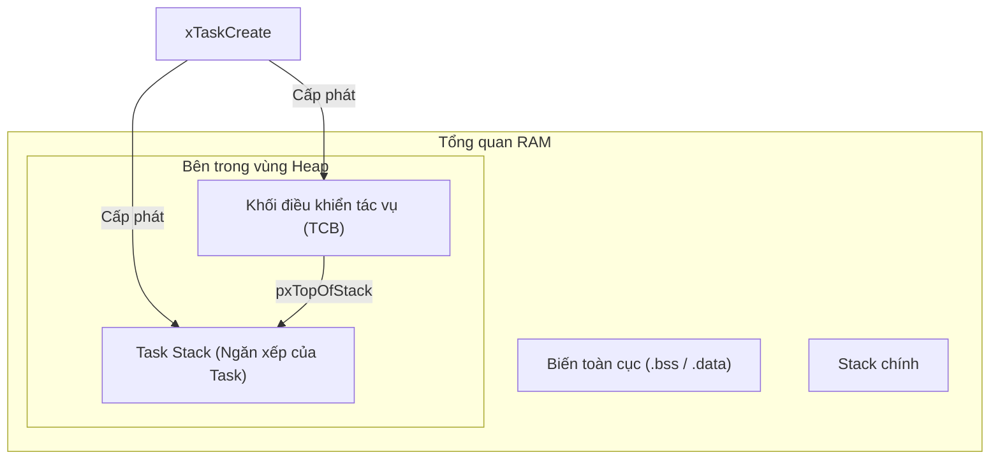
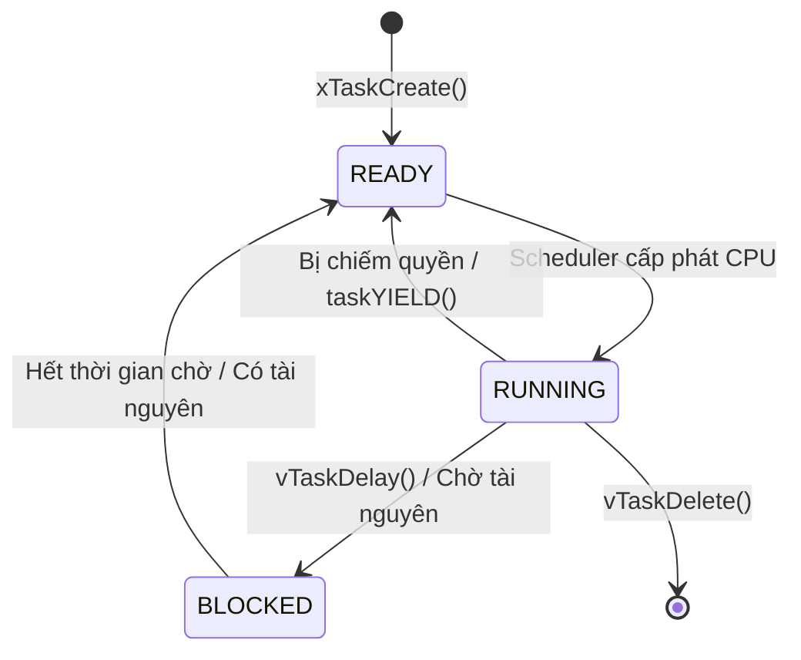

# Tạo Task Trong FreeRTOS - Hướng Dẫn Chi Tiết (Có Code Minh Họa)

## 1. Task (Tác vụ) là gì?
Trong các hệ thống nhúng thông thường (không có hệ điều hành), code của bạn thường chạy trong một vòng lặp `while(1)` khổng lồ duy nhất (gọi là Super Loop). Với FreeRTOS, chương trình của bạn được chia nhỏ thành nhiều luồng độc lập, mỗi luồng gọi là một **Task**.
Mỗi Task đóng vai trò như một chương trình nhỏ độc lập, và nó có cảm giác như đang chiếm toàn quyền điều khiển CPU.

### Cấu trúc cơ bản của một Task
Một hàm xử lý task (Task Handler) trong FreeRTOS luôn phải tuân theo định dạng: trả về kiểu `void` và nhận một tham số là con trỏ `void *`.

```c
void vTaskFunction( void *pvParameters )
{
    /* Code khởi tạo - Chỉ chạy 1 lần khi task mới bắt đầu */

    for( ;; ) /* Vòng lặp vô hạn của Task */
    {
        /* Code thực thi chính của Task nằm ở đây */
    }
}
```

## 2. Quá trình Khởi Tạo và Triển Khai Task
Quá trình này gồm 2 bước: Đăng ký tạo task với RTOS, và viết hàm code để task chạy.

### A. Khởi tạo Task với `xTaskCreate()`
Để tạo một task, ta dùng hàm API `xTaskCreate()`.

```c
#include "FreeRTOS.h"
#include "task.h"

// Biến lưu trữ Handle của Task để quản lý sau này
TaskHandle_t xTask1Handle = NULL;

int main(void)
{
    // Tạo Task số 1
    xTaskCreate(
        vTask1_handler,       /* Con trỏ trỏ đến hàm của task */
        "Task-1",             /* Tên của task (dạng chuỗi, dùng để debug) */
        configMINIMAL_STACK_SIZE, /* Kích thước bộ nhớ Stack (tính bằng Word, KHÔNG phải byte) */
        NULL,                 /* Tham số muốn truyền vào cho task */
        2,                    /* Mức độ ưu tiên (Priority) */
        &xTask1Handle         /* Biến con trỏ để nhận lại Task Handle */
    );

    // Khởi động Bộ lập lịch (Scheduler) để các task bắt đầu chạy
    vTaskStartScheduler();

    // Code sẽ KHÔNG BAO GIỜ chạy đến đây, trừ khi hệ thống không đủ RAM để khởi động RTOS
    while(1);
}
```

### B. Triển khai code cho Task (Implementation)
**3 Quy tắc Vàng:**
1. **Vòng lặp vô hạn**: Hàm của task thường chạy mãi mãi dưới dạng vòng lặp vô hạn, thực hiện việc kiểm tra hoặc phản hồi sự kiện liên tục.
2. **Không bao giờ Return**: Task tuyệt đối không được phép thực thi lệnh `return` hoặc chạy đến dấu `}` cuối cùng của hàm.
3. **Phải tự xóa mình**: Nếu task chỉ cần chạy một lần rồi thôi, nó bắt buộc phải tự xóa bản thân khỏi bộ nhớ bằng hàm `vTaskDelete(NULL)`.

```c
void vTask1_handler(void *pvParameters)
{
    // Biến cục bộ, được cấp phát trên Stack của Task
    int counter = 0;

    // Vòng lặp chính của task
    while(1)
    {
        counter++;
        
        // Đưa task vào trạng thái Block (chờ) trong 1000 ticks (giúp nhường CPU cho task khác)
        vTaskDelay(pdMS_TO_TICKS(1000)); 
    }
    
    // Nếu vì lý do nào đó thoát khỏi vòng lặp while, BẮT BUỘC phải xóa task
    vTaskDelete(NULL); 
}
```

## 3. Mức độ ưu tiên của Task (Task Priorities)
Khi có nhiều task cùng muốn chạy, **Scheduler** sẽ dựa vào **Priority** để quyết định ai được chạy.
- **Số càng nhỏ = Ưu tiên càng thấp**: Mức `0` là thấp nhất (thường dành cho Idle Task - task chạy lúc rảnh rỗi).
- **Số càng lớn = Ưu tiên càng cao**: Mức ưu tiên tối đa được giới hạn bởi `configMAX_PRIORITIES - 1`.

**Ảnh hưởng đến bộ nhớ**: Bạn cấu hình biến này trong file `FreeRTOSConfig.h`.
```c
#define configMAX_PRIORITIES  ( 5 ) // Hệ thống có 5 mức ưu tiên: 0, 1, 2, 3, 4
```
*Lưu ý: Mọi mức ưu tiên được thêm vào sẽ khiến FreeRTOS phải tạo thêm một "Ready List" riêng biệt, gây tốn RAM. Ngoài ra, quá nhiều mức ưu tiên khiến hệ thống mất thời gian chuyển đổi ngữ cảnh liên tục (context switching), làm giảm hiệu suất.*

## 4. Chuyện gì xảy ra trong bộ nhớ RAM? (TCB và Stack)
Khi bạn gọi hàm `xTaskCreate()`, RAM của Vi điều khiển (ví dụ 128KB SRAM) sẽ được sử dụng ra sao?



FreeRTOS trích xuất bộ nhớ từ một vùng quản lý động gọi là **Heap** (kích thước do `configTOTAL_HEAP_SIZE` quyết định). Sẽ có 2 thành phần được tạo ra động:
1. **Khối điều khiển tác vụ (TCB - Task Control Block)**: Một cấu trúc struct C (định nghĩa trong `tasks.c`) chứa toàn bộ thông tin quản lý task (trạng thái, tên, độ ưu tiên).
2. **Task Stack (Ngăn xếp của Task)**: Một khoảng bộ nhớ để task lưu trữ biến cục bộ, các hàm gọi lồng nhau và trạng thái thanh ghi CPU khi task bị ngắt nhường chỗ cho task khác.

**Sự liên kết**: Thành phần đầu tiên trong cấu trúc TCB là biến con trỏ `pxTopOfStack`, trỏ thẳng tới đỉnh của vùng Task Stack vừa được tạo. Vi xử lý ARM Cortex-M dùng thanh ghi PSP (Process Stack Pointer) để theo dõi cái này.

## 5. Lập lịch (Scheduling)
**Scheduler** là bộ não của FreeRTOS, chạy ở chế độ đặc quyền của CPU, nó quét danh sách "Ready List" và quyết định task nào được chiếm CPU.



- Các task mới tạo mặc định sẽ nằm ở trạng thái **READY** (Sẵn sàng).
- Bạn phải gọi hàm `vTaskStartScheduler()` trong hàm `main()` để chuyển quyền điều khiển từ `main` sang RTOS.

### Các chính sách Lập Lịch
Được cấu hình thông qua `configUSE_PREEMPTION`.

#### A. Lập lịch Chiếm Quyền - Pre-emptive (`configUSE_PREEMPTION = 1`)
**Chiếm quyền (Pre-emption)** nghĩa là hệ điều hành ép một task đang chạy phải nhường CPU cho task khác một cách cưỡng chế.

- **Theo mức ưu tiên (Priority-based)**: Một task ưu tiên CAO vừa sẵn sàng sẽ lập tức hất văng task ưu tiên THẤP ra khỏi CPU để chiếm quyền chạy. Task thấp bị đẩy về trạng thái READY.

```mermaid
gantt
    title Mô phỏng Lập lịch Chiếm quyền (Priority-based)
    dateFormat  s
    axisFormat  %S
    
    section Task 2 (Ưu tiên THẤP)
    Đang chạy         :active, t2_1, 0, 2s
    Bị chiếm quyền (Ready):crit, t2_2, 2, 3s
    Đang chạy         :active, t2_3, 5, 2s

    section Task 1 (Ưu tiên CAO)
    Đang chờ (Blocked) :done, t1_1, 0, 2s
    Đang chạy (Chiếm) :active, t1_2, 2, 3s
    Đang chờ (Blocked) :done, t1_3, 5, 2s
```



- **Round-Robin (Vòng tròn định mức thời gian)**: Nếu có 2 task **cùng một mức ưu tiên cao nhất**, CPU sẽ tự động chia đều thời gian (time slices) dựa vào Tick Interrupt để hai task thay phiên nhau chạy.

```mermaid
gantt
    title Mô phỏng Lập lịch Round-Robin (Cùng mức ưu tiên)
    dateFormat  s
    axisFormat  %S

    section Task A
    Đang chạy :active, ta1, 0, 1s
    Sẵn sàng  :done, ta2, 1, 1s
    Đang chạy :active, ta3, 2, 1s
    Sẵn sàng  :done, ta4, 3, 1s

    section Task B
    Sẵn sàng  :done, tb1, 0, 1s
    Đang chạy :active, tb2, 1, 1s
    Sẵn sàng  :done, tb3, 2, 1s
    Đang chạy :active, tb4, 3, 1s
```



#### B. Lập lịch Hợp Tác - Co-operative (`configUSE_PREEMPTION = 0`)
Hệ điều hành **không bao giờ** cưỡng chế ngắt một task đang chạy. Task đang chiếm CPU sẽ chạy mãi mãi cho đến khi nó tự nguyện (explicitly) nhường CPU.
- Task tự nguyện nhường CPU bằng cách: gọi hàm chặn như `vTaskDelay()`, chờ cờ Semaphore/Queue, hoặc gọi `taskYIELD()`.
- Dù Tick Interrupt (ngắt thời thực) của hệ thống vẫn hoạt động, nó sẽ không kích hoạt quá trình chuyển đổi task (Context Switch).

## 6. Debug: In thông báo qua chân SWO (ITM)
Trong hệ điều hành RTOS, việc dùng hàm `printf` tiêu chuẩn qua UART là "thảm họa" vì nó rất chậm và chặn luôn cả CPU (block).
Giải pháp thay thế trên chip ARM Cortex là sử dụng phần cứng **ITM (Instrumentation Trace Macrocell)** qua chân **SWO**. Nó cung cấp khả năng in `printf` với tốc độ cực cao, hoạt động song song không làm nghẽn CPU, rất tuyệt vời để theo dõi trạng thái hệ điều hành.

## 7. Giải thích chi tiết các câu hỏi kỹ thuật (Q&A)

**Câu 1: Nếu bạn tạo động một task trong FreeRTOS với vùng nhớ stack là 512 bytes, thì tổng số byte trong vùng Heap bị tiêu thụ là bao nhiêu?**
**Đáp án**: `512 bytes + sizeof(TCB)`.
Khi dùng `xTaskCreate`, cả bộ nhớ Stack của task VÀ khối điều khiển TCB đều được lấy ra từ vùng Heap.

**Câu 2: Thành phần đầu tiên bên trong cấu trúc TCB là gì?**
**Đáp án**: Một con trỏ lưu trữ địa chỉ đỉnh Stack của Task (`pxTopOfStack`). Điều này rất quan trọng để khi CPU chuyển ngữ cảnh (context switch), mã ASM cấp thấp có thể lấy ngay địa chỉ stack để khôi phục thanh ghi.

**Câu 3: Có đúng là các task sẽ không chạy cho đến khi bạn gọi hàm `vTaskStartScheduler()` không?**
**Đáp án**: Đúng. Dù bạn có tạo 10 task, chúng chỉ nằm chờ trong danh sách Ready. `vTaskStartScheduler()` sẽ khởi động ngắt SysTick và kích hoạt quá trình đưa task đầu tiên vào CPU chạy.

**Câu 4: Giả sử có 2 task (1 cao, 1 thấp) trong chế độ lập lịch Pre-emptive. Làm cách nào để task ưu tiên THẤP có cơ hội chạy?**
**Đáp án**: Task ưu tiên CAO bắt buộc phải rơi vào trạng thái Blocked (chờ sự kiện, gọi `vTaskDelay`) hoặc Suspended (bị tạm dừng), hoặc tự động gọi `taskYIELD()`. Nếu task CAO cứ chạy liên tục không bao giờ block, task THẤP sẽ bị **Starvation** (chết đói CPU - không bao giờ được chạy).

**Câu 5 & Câu 6: Cấp phát tĩnh (Static Allocation)**
FreeRTOS hỗ trợ tạo task tĩnh qua `xTaskCreateStatic`. Ở chế độ này, bạn không dùng Heap. Toàn bộ TCB và Stack do bạn tự tạo thành mảng toàn cục, chúng nằm ở vùng RAM toàn cục (Global Area / `.bss` hoặc `.data`).
```c
// Lập trình viên tự cấp phát mảng làm Stack và TCB
StackType_t xTaskStack[100];
StaticTask_t xTaskBuffer;

xTaskCreateStatic(vTaskFunction, "Task", 100, NULL, 1, xTaskStack, &xTaskBuffer);
```

**Câu 7: Giả sử có một biến `static` được khai báo bên trong hàm task, bộ nhớ cho biến đó nằm ở đâu?**
**Đáp án**: Ở vùng biến toàn cục của RAM (`.data` section), KHÔNG phải trên Stack của task.
```c
void vTask_function(void *p) {
    static int i = 10; // Nằm ở RAM toàn cục, tồn tại suốt vòng đời chương trình
    while(1) { ... }
}
```

**Câu 8: Giả sử có một biến cục bộ (non-static) được khai báo bên trong hàm task, bộ nhớ cho biến đó nằm ở đâu?**
**Đáp án**: Nằm trực tiếp trên vùng bộ nhớ Stack riêng của chính Task đó.
```c
void vTask_function(void *p) {
    int i = 0; // Biến này nằm trên Task Stack đã cấp phát lúc xTaskCreate
    while(1) { ... }
}
```
