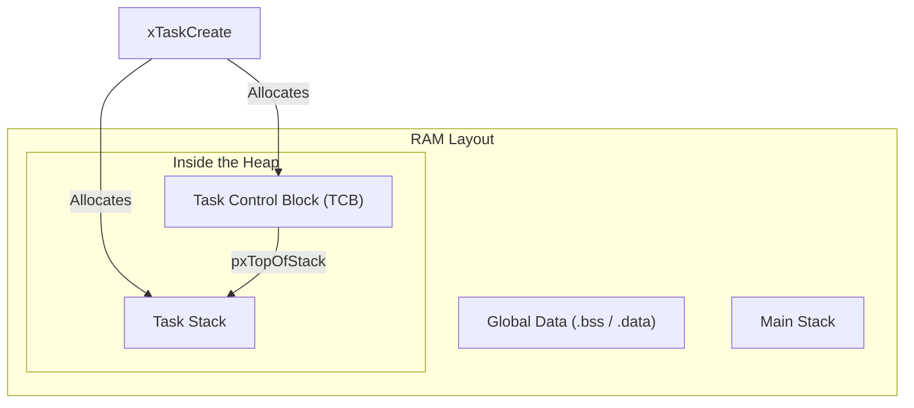
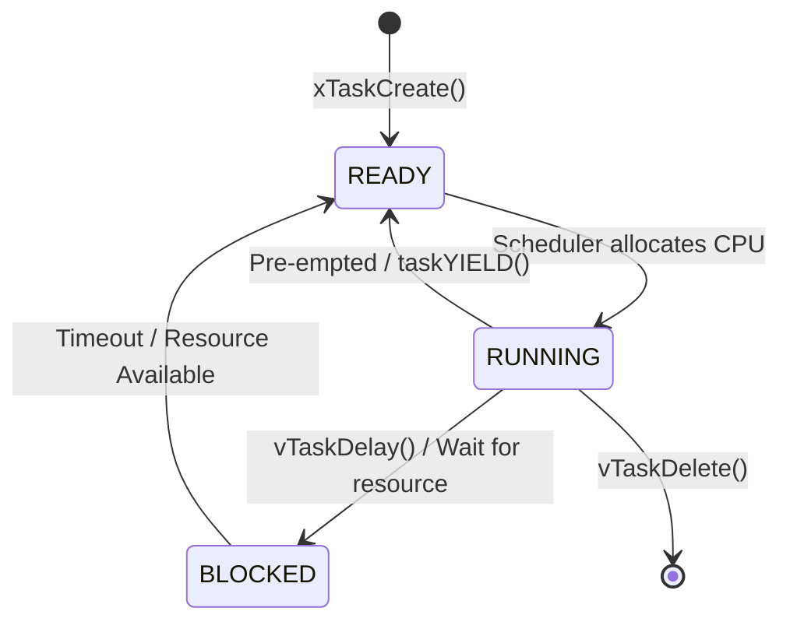

# FreeRTOS Task Creation - Detailed Guide

## 1. What is a Task?
In a bare-metal embedded system (without an OS), your code typically runs in a single large infinite loop (the "Super Loop"). In FreeRTOS, the application is divided into independent chunks of code called **Tasks**.
A Task is simply a C function that can be scheduled to run on the CPU. Each task behaves as if it has the entire CPU to itself.

### The Anatomy of a Task
A task function in FreeRTOS must have a specific signature: it returns `void` and takes a single `void *` parameter.

```c
void vTaskFunction( void *pvParameters )
{
    /* Task initialization code goes here */

    for( ;; ) /* Infinite loop */
    {
        /* Task application code goes here */
    }
}
```

## 2. Creating and Implementing a Task
Creating a task involves two steps: calling the FreeRTOS API to register the task, and writing the C function that implements it.

### A. Creating the Task: `xTaskCreate()`
To create a task, you use the `xTaskCreate()` API function.

```c
#include "FreeRTOS.h"
#include "task.h"

// Task handles
TaskHandle_t xTask1Handle = NULL;

int main(void)
{
    // Create Task 1
    xTaskCreate(
        vTask1_handler,       /* Pointer to the function that implements the task */
        "Task-1",             /* Text name for the task (useful for debugging) */
        configMINIMAL_STACK_SIZE, /* Stack size in words (not bytes!) */
        NULL,                 /* Parameter passed into the task */
        2,                    /* Priority at which the task is created */
        &xTask1Handle         /* Pointer to store the task handle */
    );

    // Start the scheduler so the tasks start executing
    vTaskStartScheduler();

    // The code should never reach here unless there is insufficient RAM
    for(;;);
}
```

### B. Implementing the Task Handler
**Key Rules:**
1. **Infinite Loop**: A task usually runs forever, performing its duty periodically or reacting to events.
2. **Never Return**: A task function must never execute a `return` statement or reach the end of its closing bracket `}`.
3. **Deleting**: If a task is only meant to run once, it must delete itself using `vTaskDelete(NULL)`.

```c
void vTask1_handler(void *pvParameters)
{
    // Initialization (runs once when the task starts)
    int counter = 0;

    // The Task Loop
    while(1)
    {
        // Do something
        counter++;
        
        // Wait for 1000 ticks (Blocking state)
        vTaskDelay(pdMS_TO_TICKS(1000)); 
    }
    
    // A task MUST NOT return. If we break out of the loop, we must delete it.
    vTaskDelete(NULL); 
}
```

## 3. Task Priorities
When multiple tasks are ready to run, the CPU can only execute one at a time. The **Scheduler** decides which one runs based on **Priority**.
- **Lower Priority Number = Lower Urgency**: Priority 0 is the lowest (typically given to the Idle task).
- **Higher Priority Number = Higher Urgency**: The maximum priority is `(configMAX_PRIORITIES - 1)`.

**Memory Impact**: You configure `configMAX_PRIORITIES` in `FreeRTOSConfig.h`.
```c
#define configMAX_PRIORITIES  ( 5 ) // Priorities 0, 1, 2, 3, 4 are available
```
*Note: Using too many priority levels wastes RAM, as FreeRTOS maintains a separate "Ready List" for each priority level. It can also degrade performance due to excessive context switching if not designed carefully.*

## 4. Under the Hood: Task Creation and RAM
What happens inside the microcontroller's RAM (e.g., 128KB SRAM) when you create a task dynamically via `xTaskCreate()`?



FreeRTOS pulls memory from a dedicated pool called the **Heap** (`configTOTAL_HEAP_SIZE`).
When `xTaskCreate()` is called, two critical structures are allocated in the Heap:
1. **The TCB (Task Control Block)**: A C structure (defined in `tasks.c`) that holds the task's state, priority, name, and stack pointers.
2. **The Task Stack**: A block of memory used to store local variables, function calls, and CPU registers when the task is swapped out.

**How they connect**: The first member of the TCB structure is `pxTopOfStack`, which points to the top of this newly allocated Task Stack. The ARM Cortex-M Processor uses the PSP (Process Stack Pointer) to keep track of this.

## 5. Scheduling
The **Scheduler** is the core of FreeRTOS. It is a piece of code that runs in privileged mode, deciding which task in the "Ready List" gets CPU time.



- Tasks are created in the **READY** state.
- You must call `vTaskStartScheduler()` to transfer control from `main()` to the RTOS.

### Scheduling Policies
Controlled by `configUSE_PREEMPTION` in `FreeRTOSConfig.h`.

#### A. Pre-emptive Scheduling (`configUSE_PREEMPTION = 1`)
**Pre-emption** means replacing a running task with another task involuntarily.

- **Priority-based Pre-emption**: A higher-priority task will immediately preempt a lower-priority task the moment the higher-priority task becomes READY. The lower-priority task is forced back to the READY state.

```mermaid
gantt
    title Priority-based Pre-emption Simulation
    dateFormat  s
    axisFormat  %S
    
    section Task 2 (Low Prio)
    Running           :active, t2_1, 0, 2s
    Pre-empted (Ready):crit, t2_2, 2, 3s
    Running           :active, t2_3, 5, 2s

    section Task 1 (High Prio)
    Blocked (Delay)   :done, t1_1, 0, 2s
    Running (Preempts):active, t1_2, 2, 3s
    Blocked (Delay)   :done, t1_3, 5, 2s
```



- **Round-Robin (Time Slicing)**: If two tasks share the *same* priority, the CPU time is divided into equal "Time Slices" (Tick interrupts). They take turns executing cyclically.


#### B. Co-operative Scheduling (`configUSE_PREEMPTION = 0`)
The scheduler will **never** interrupt a running task to swap it out. The running task has total control of the CPU until it explicitly yields.
- A task yields by calling blocking functions like `vTaskDelay()`, `xQueueReceive()`, or explicitly giving up the CPU via `taskYIELD()`.
- The RTOS tick interrupt still fires to track time, but it won't force a context switch.

## 6. Printf over SWO Pin (ITM)
Using standard UART for `printf` inside an RTOS can cause massive delays and bugs because standard `printf` is slow and blocks the CPU.
Instead, ARM Cortex processors feature the **ITM (Instrumentation Trace Macrocell)**. You can route `printf` through the SWO (Serial Wire Output) pin. It is highly optimized, application-driven, and supports tracing operating system events with minimal overhead.

## 7. Deep Dive Q&A

**Q1: If you dynamically create a FreeRTOS Task with 512 bytes of stack, how many bytes in the heap region will be consumed?**
**Answer**: `512 bytes + sizeof(TCB)`.
When using `xTaskCreate`, FreeRTOS allocates the Task Stack *and* the Task Control Block (TCB) dynamically from the Heap.

**Q2: What is the first member element of the TCB Structure?**
**Answer**: A pointer holding the top of the Task's Stack (`pxTopOfStack`). This is critical because when a context switch occurs, the assembly code needs to quickly find where the stack pointer was saved.

**Q3: Tasks won't run until you start the scheduler in FreeRTOS. True or False?**
**Answer**: True. Even if you create 10 tasks, they just sit in the Ready list. `vTaskStartScheduler()` configures the system timers (SysTick) and triggers the first context switch.

**Q4: In priority-based preemptive scheduling, how does a lower-priority task get CPU time from a higher-priority task?**
**Answer**: The higher-priority task must enter the Blocked or Suspended state (e.g., using `vTaskDelay`, waiting for a Semaphore, or `vTaskSuspend`). If the high-priority task never blocks, the lower-priority task will **starve** (never run).

**Q5 & Q6: Static Task Allocation (`xTaskCreateStatic`)**
FreeRTOS supports static allocation. If you use it, both the TCB and the Stack are NOT in the Heap. They are allocated in the Global RAM space (`.bss` or `.data` sections) by the programmer.
```c
// Statically allocated stack and TCB
StackType_t xTaskStack[100];
StaticTask_t xTaskBuffer;

xTaskCreateStatic(vTaskFunction, "Task", 100, NULL, 1, xTaskStack, &xTaskBuffer);
```

**Q7: Where is memory allocated for a static variable declared inside a task function?**
**Answer**: In the Global Area (`.data` or `.bss` section) of the RAM.
```c
void vTask_function(void *p) {
    static int i = 10; // Lives in Global RAM, NOT on the task stack!
    while(1) { ... }
}
```

**Q8: Where is memory allocated for a non-static local variable declared inside a task function?**
**Answer**: In the specific Task's Stack space.
```c
void vTask_function(void *p) {
    int i = 0; // Lives inside the Task's dynamically allocated stack
    while(1) { ... }
}
```
