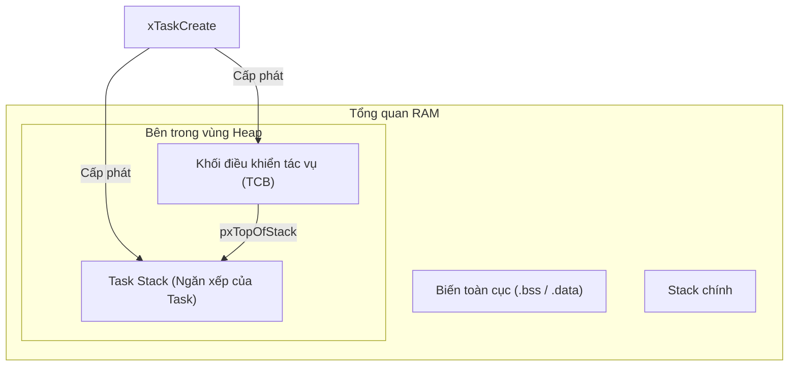
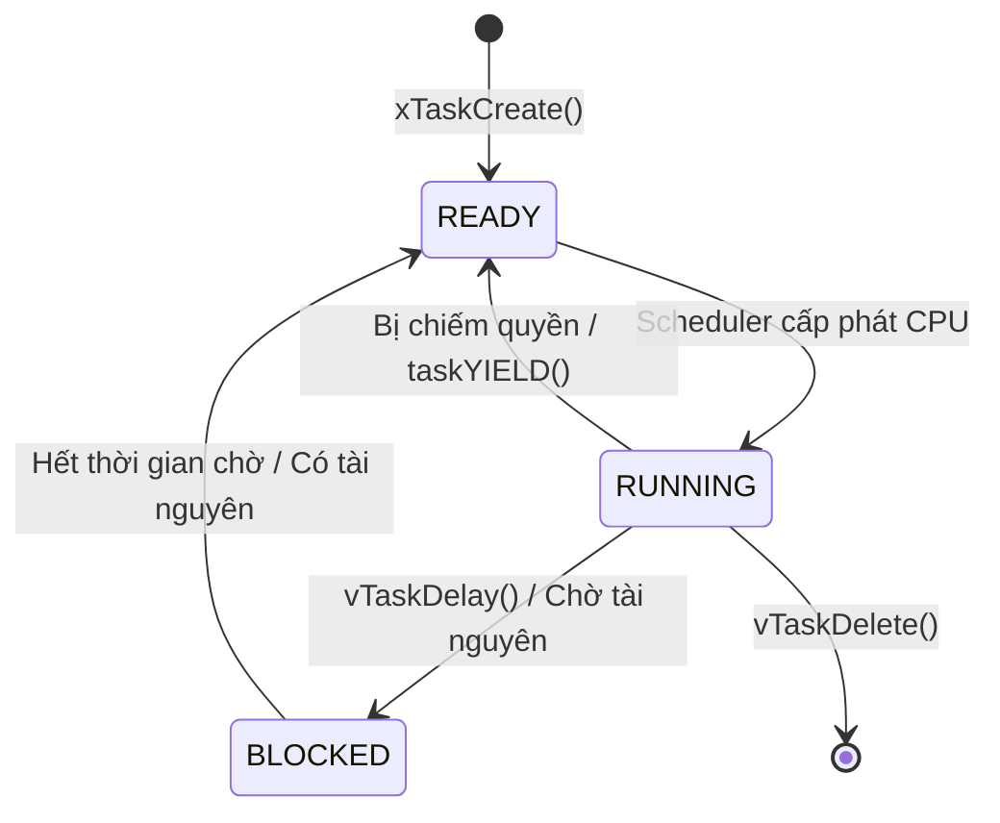

# Tạo Task Trong FreeRTOS - Hướng Dẫn Chi Tiết (Có Code Minh Họa)

## 1. Task (Tác vụ) là gì?
Trong các hệ thống nhúng thông thường (không có hệ điều hành), code của bạn thường chạy trong một vòng lặp `while(1)` khổng lồ duy nhất (gọi là Super Loop). Với FreeRTOS, chương trình của bạn được chia nhỏ thành nhiều luồng độc lập, mỗi luồng gọi là một **Task**.
Mỗi Task đóng vai trò như một chương trình nhỏ độc lập, và nó có cảm giác như đang chiếm toàn quyền điều khiển CPU.

### Cấu trúc cơ bản của một Task
Một hàm xử lý task (Task Handler) trong FreeRTOS luôn phải tuân theo định dạng: trả về kiểu `void` và nhận một tham số là con trỏ `void *`.

```c
void vTaskFunction( void *pvParameters )
{
    /* Code khởi tạo - Chỉ chạy 1 lần khi task mới bắt đầu */

    for( ;; ) /* Vòng lặp vô hạn của Task */
    {
        /* Code thực thi chính của Task nằm ở đây */
    }
}
```

## 2. Quá trình Khởi Tạo và Triển Khai Task
Quá trình này gồm 2 bước: Đăng ký tạo task với RTOS, và viết hàm code để task chạy.

### A. Khởi tạo Task với `xTaskCreate()`
Để tạo một task, ta dùng hàm API `xTaskCreate()`.

```c
#include "FreeRTOS.h"
#include "task.h"

// Biến lưu trữ Handle của Task để quản lý sau này
TaskHandle_t xTask1Handle = NULL;

int main(void)
{
    // Tạo Task số 1
    xTaskCreate(
        vTask1_handler,       /* Con trỏ trỏ đến hàm của task */
        "Task-1",             /* Tên của task (dạng chuỗi, dùng để debug) */
        configMINIMAL_STACK_SIZE, /* Kích thước bộ nhớ Stack (tính bằng Word, KHÔNG phải byte) */
        NULL,                 /* Tham số muốn truyền vào cho task */
        2,                    /* Mức độ ưu tiên (Priority) */
        &xTask1Handle         /* Biến con trỏ để nhận lại Task Handle */
    );

    // Khởi động Bộ lập lịch (Scheduler) để các task bắt đầu chạy
    vTaskStartScheduler();

    // Code sẽ KHÔNG BAO GIỜ chạy đến đây, trừ khi hệ thống không đủ RAM để khởi động RTOS
    while(1);
}
```

### B. Triển khai code cho Task (Implementation)
**3 Quy tắc Vàng:**
1. **Vòng lặp vô hạn**: Hàm của task thường chạy mãi mãi dưới dạng vòng lặp vô hạn, thực hiện việc kiểm tra hoặc phản hồi sự kiện liên tục.
2. **Không bao giờ Return**: Task tuyệt đối không được phép thực thi lệnh `return` hoặc chạy đến dấu `}` cuối cùng của hàm.
3. **Phải tự xóa mình**: Nếu task chỉ cần chạy một lần rồi thôi, nó bắt buộc phải tự xóa bản thân khỏi bộ nhớ bằng hàm `vTaskDelete(NULL)`.

```c
void vTask1_handler(void *pvParameters)
{
    // Biến cục bộ, được cấp phát trên Stack của Task
    int counter = 0;

    // Vòng lặp chính của task
    while(1)
    {
        counter++;
        
        // Đưa task vào trạng thái Block (chờ) trong 1000 ticks (giúp nhường CPU cho task khác)
        vTaskDelay(pdMS_TO_TICKS(1000)); 
    }
    
    // Nếu vì lý do nào đó thoát khỏi vòng lặp while, BẮT BUỘC phải xóa task
    vTaskDelete(NULL); 
}
```

## 3. Mức độ ưu tiên của Task (Task Priorities)
Khi có nhiều task cùng muốn chạy, **Scheduler** sẽ dựa vào **Priority** để quyết định ai được chạy.
- **Số càng nhỏ = Ưu tiên càng thấp**: Mức `0` là thấp nhất (thường dành cho Idle Task - task chạy lúc rảnh rỗi).
- **Số càng lớn = Ưu tiên càng cao**: Mức ưu tiên tối đa được giới hạn bởi `configMAX_PRIORITIES - 1`.

**Ảnh hưởng đến bộ nhớ**: Bạn cấu hình biến này trong file `FreeRTOSConfig.h`.
```c
#define configMAX_PRIORITIES  ( 5 ) // Hệ thống có 5 mức ưu tiên: 0, 1, 2, 3, 4
```
*Lưu ý: Mọi mức ưu tiên được thêm vào sẽ khiến FreeRTOS phải tạo thêm một "Ready List" riêng biệt, gây tốn RAM. Ngoài ra, quá nhiều mức ưu tiên khiến hệ thống mất thời gian chuyển đổi ngữ cảnh liên tục (context switching), làm giảm hiệu suất.*

## 4. Giải phẫu chuyên sâu: TCB và Bản đồ Bộ Nhớ (Memory Layout)
Để làm chủ FreeRTOS, bạn bắt buộc phải hiểu cách nó quản lý RAM và chuyện gì thực sự xảy ra dưới lớp vỏ (under the hood) khi một task được sinh ra.

### A. Bản đồ Bộ Nhớ (RAM Layout)
Khi chương trình FreeRTOS chạy trên vi điều khiển (ví dụ có 128KB SRAM), bộ nhớ RAM được chia thành các phân vùng rõ rệt:

1. **Vùng Toàn Cục (`.data` và `.bss`)**: Nơi lưu trữ các biến toàn cục (global) và biến `static`. Vùng này được cấp phát cố định ngay từ lúc biên dịch code.
2. **Stack Chính (Main Stack - MSP)**: Được sử dụng bởi hàm `main()`, các ngắt phần cứng (ISRs), và chính bản thân nhân (kernel) của FreeRTOS.
3. **Vùng nhớ Heap của FreeRTOS**: Một mảng bộ nhớ khổng lồ (kích thước do `configTOTAL_HEAP_SIZE` quyết định) được khoanh vùng dành riêng cho FreeRTOS để cấp phát động.

Khi bạn gọi hàm `xTaskCreate()`, FreeRTOS sẽ gọi hàm `pvPortMalloc()` để "cắt" ra 2 khối bộ nhớ từ **Vùng Heap**:
- **Task Stack (Ngăn xếp của Task)**.
- **TCB (Khối điều khiển tác vụ - Task Control Block)**.



### B. Ngăn xếp của Task (Task Stack) dùng để chứa gì?
Mỗi task có một vùng Stack độc lập. Khi task đang chạy, CPU sẽ dùng thanh ghi PSP (Process Stack Pointer) để trỏ vào Stack này. Task Stack chứa 3 thứ cực kỳ quan trọng:
- **Biến cục bộ**: Các biến (không có chữ `static`) khai báo bên trong hàm của task.
- **Dữ liệu gọi hàm**: Khi task gọi các hàm con, địa chỉ trả về (return address) và tham số được đẩy vào đây.
- **Lưu trữ ngữ cảnh (Context Saving)**: Khi Scheduler tạm dừng task này để cho task khác chạy (Context Switch), toàn bộ trạng thái thanh ghi của CPU (R0-R15, cờ trạng thái...) sẽ được "đẩy" (push) vào Task Stack này để lưu giữ. Khi task được chạy lại, các thanh ghi này được "kéo" (pop) ra để tiếp tục công việc như chưa hề có cuộc chia ly.

### C. Mổ xẻ cấu trúc TCB (`tskTaskControlBlock`)
TCB giống như "Căn cước công dân" của một task. Kernel dùng TCB để theo dõi mọi ngóc ngách của task. Nếu bạn mở file `tasks.c` trong mã nguồn FreeRTOS, cấu trúc `TCB_t` (hay `tskTCB`) trông sẽ như sau (đã rút gọn):

```c
typedef struct tskTaskControlBlock
{
    volatile StackType_t *pxTopOfStack; /* BẮT BUỘC LÀ THÀNH PHẦN ĐẦU TIÊN! Trỏ đến đỉnh hiện tại của Task Stack. */

    ListItem_t xStateListItem;          /* Dùng để gắn TCB vào các danh sách Ready/Blocked/Suspended. */
    ListItem_t xEventListItem;          /* Dùng để gắn TCB vào danh sách chờ sự kiện (VD: chờ Queue, Semaphore). */
    UBaseType_t uxPriority;             /* Mức độ ưu tiên của task. */
    StackType_t *pxStack;               /* Trỏ đến điểm bắt đầu của vùng Stack (dùng để kiểm tra tràn Stack - Overflow). */
    char pcTaskName[ configMAX_TASK_NAME_LEN ]; /* Tên của task (dạng chuỗi ký tự). */
    
    // ... các thành phần khác tùy thuộc vào config (VD: Mutex, Thread Local Storage...)
} tskTCB;
```

**Giải thích các thành phần cốt lõi của TCB:**
1. **`pxTopOfStack`**: Biến này **bắt buộc phải nằm ở vị trí đầu tiên** của struct. Tại sao? Khi CPU chuyển ngữ cảnh (Context Switch), các đoạn code Assembly cấp thấp cần tìm đến địa chỉ đỉnh Stack của task ngay lập tức để khôi phục thanh ghi. Việc đặt nó ở đầu tiên giúp địa chỉ của con trỏ này trùng khớp với địa chỉ của chính khối TCB (offset = 0), giúp lệnh Assembly chạy với tốc độ nhanh nhất.
2. **`xStateListItem`**: FreeRTOS quản lý các task bằng các Danh sách liên kết đôi (Doubly Linked Lists) (ví dụ: danh sách Ready, danh sách Delay). Biến này đóng vai trò là một "mắt xích" (node) để móc khối TCB vào các danh sách đó tùy thuộc vào trạng thái hiện tại của task.
3. **`pxStack`**: Trong khi `pxTopOfStack` liên tục nhảy lên nhảy xuống trong quá trình task chạy, thì `pxStack` luôn trỏ cố định vào "đáy" (địa chỉ bắt đầu) của vùng nhớ Stack đã cấp phát. FreeRTOS dùng nó để đối chiếu và phát hiện lỗi **Tràn Stack (Stack Overflow)** nguy hiểm.

## 5. Lập lịch (Scheduling)
**Scheduler** là bộ não của FreeRTOS, chạy ở chế độ đặc quyền của CPU, nó quét danh sách "Ready List" và quyết định task nào được chiếm CPU.



- Các task mới tạo mặc định sẽ nằm ở trạng thái **READY** (Sẵn sàng).
- Bạn phải gọi hàm `vTaskStartScheduler()` trong hàm `main()` để chuyển quyền điều khiển từ `main` sang RTOS.

### Các chính sách Lập Lịch
Được cấu hình thông qua `configUSE_PREEMPTION`.

#### A. Lập lịch Chiếm Quyền - Pre-emptive (`configUSE_PREEMPTION = 1`)
**Chiếm quyền (Pre-emption)** nghĩa là hệ điều hành ép một task đang chạy phải nhường CPU cho task khác một cách cưỡng chế.

- **Theo mức ưu tiên (Priority-based)**: Một task ưu tiên CAO vừa sẵn sàng sẽ lập tức hất văng task ưu tiên THẤP ra khỏi CPU để chiếm quyền chạy. Task thấp bị đẩy về trạng thái READY.

```mermaid
gantt
    title Mô phỏng Lập lịch Chiếm quyền (Priority-based)
    dateFormat  s
    axisFormat  %S
    
    section Task 2 (Ưu tiên THẤP)
    Đang chạy         :active, t2_1, 0, 2s
    Bị chiếm quyền (Ready):crit, t2_2, 2, 3s
    Đang chạy         :active, t2_3, 5, 2s

    section Task 1 (Ưu tiên CAO)
    Đang chờ (Blocked) :done, t1_1, 0, 2s
    Đang chạy (Chiếm) :active, t1_2, 2, 3s
    Đang chờ (Blocked) :done, t1_3, 5, 2s
```



- **Round-Robin (Vòng tròn định mức thời gian)**: Nếu có 2 task **cùng một mức ưu tiên cao nhất**, CPU sẽ tự động chia đều thời gian (time slices) dựa vào Tick Interrupt để hai task thay phiên nhau chạy.

```mermaid
gantt
    title Mô phỏng Lập lịch Round-Robin (Cùng mức ưu tiên)
    dateFormat  s
    axisFormat  %S

    section Task A
    Đang chạy :active, ta1, 0, 1s
    Sẵn sàng  :done, ta2, 1, 1s
    Đang chạy :active, ta3, 2, 1s
    Sẵn sàng  :done, ta4, 3, 1s

    section Task B
    Sẵn sàng  :done, tb1, 0, 1s
    Đang chạy :active, tb2, 1, 1s
    Sẵn sàng  :done, tb3, 2, 1s
    Đang chạy :active, tb4, 3, 1s
```



#### B. Lập lịch Hợp Tác - Co-operative (`configUSE_PREEMPTION = 0`)
Hệ điều hành **không bao giờ** cưỡng chế ngắt một task đang chạy. Task đang chiếm CPU sẽ chạy mãi mãi cho đến khi nó tự nguyện (explicitly) nhường CPU.
- Task tự nguyện nhường CPU bằng cách: gọi hàm chặn như `vTaskDelay()`, chờ cờ Semaphore/Queue, hoặc gọi `taskYIELD()`.
- Dù Tick Interrupt (ngắt thời thực) của hệ thống vẫn hoạt động, nó sẽ không kích hoạt quá trình chuyển đổi task (Context Switch).

## 6. Debug: In thông báo qua chân SWO (ITM)
Trong hệ điều hành RTOS, việc dùng hàm `printf` tiêu chuẩn qua UART là "thảm họa" vì nó rất chậm và chặn luôn cả CPU (block).
Giải pháp thay thế trên chip ARM Cortex là sử dụng phần cứng **ITM (Instrumentation Trace Macrocell)** qua chân **SWO**. Nó cung cấp khả năng in `printf` với tốc độ cực cao, hoạt động song song không làm nghẽn CPU, rất tuyệt vời để theo dõi trạng thái hệ điều hành.

## 7. Giải thích chi tiết các câu hỏi kỹ thuật (Trắc nghiệm)

**Câu 1: Nếu bạn tạo động một task trong FreeRTOS với vùng nhớ stack là 512 bytes, thì tổng số byte trong vùng Heap bị tiêu thụ là bao nhiêu?**
- [ ] A) 512 bytes
- [ ] B) (512*4) + sizeof(TCB)
- [x] C) 512 + sizeof(TCB)

> **Đáp án: C**
> **Giải thích:** Khi dùng `xTaskCreate`, cả bộ nhớ Stack của task VÀ khối điều khiển TCB đều được lấy ra từ vùng Heap.

**Câu 2: Thành phần đầu tiên bên trong cấu trúc TCB là gì?**
- [ ] A) Trạng thái Task (Task State)
- [ ] B) Mức ưu tiên (Task priority)
- [ ] C) Kích thước bộ nhớ Stack
- [x] D) Một con trỏ lưu trữ địa chỉ đỉnh Stack của Task

> **Đáp án: D**
> **Giải thích:** Biến `pxTopOfStack` rất quan trọng. Khi CPU chuyển ngữ cảnh (context switch), mã ASM cấp thấp cần lấy ngay địa chỉ stack này để khôi phục các thanh ghi.

**Câu 3: Có đúng là các task sẽ không chạy cho đến khi bạn gọi hàm `vTaskStartScheduler()` không?**
- [x] A) Đúng
- [ ] B) Sai

> **Đáp án: A**
> **Giải thích:** Dù bạn có tạo bao nhiêu task, chúng chỉ nằm chờ trong danh sách Ready. Bạn phải gọi hàm này để khởi động ngắt thời gian (SysTick) và kích hoạt việc đưa task đầu tiên vào CPU.

**Câu 4: Giả sử có 2 task (1 cao, 1 thấp) trong chế độ lập lịch Pre-emptive. Làm cách nào để task ưu tiên THẤP có cơ hội chạy?**
- [ ] A) Không có cách nào!
- [ ] B) Cách duy nhất là task ưu tiên cao phải gọi hàm nhường quyền (yielding)
- [ ] C) Cách duy nhất là task ưu tiên cao phải bị block
- [x] D) Task ưu tiên cao bị block, suspend hoặc gọi lệnh nhường quyền đều giúp task thấp được chạy.

> **Đáp án: D**
> **Giải thích:** Task ưu tiên CAO bắt buộc phải rơi vào trạng thái chờ (Blocked/Suspended) hoặc tự động nhường (Yielding). Nếu không, task THẤP sẽ không bao giờ được chạy (chết đói CPU).

**Câu 5: Có thể tạo task bằng phương pháp cấp phát tĩnh (static allocation) trong FreeRTOS không?**
- [x] A) Có
- [ ] B) Không, FreeRTOS chỉ hỗ trợ cấp phát động.

> **Đáp án: A**
> **Giải thích:** FreeRTOS hoàn toàn hỗ trợ thông qua hàm `xTaskCreateStatic()`.

**Câu 6: Khi bạn tạo một task bằng phương pháp tĩnh, vùng nhớ stack của task sẽ nằm ở đâu?**
- [ ] A) Trong không gian Stack chính của RAM
- [ ] B) Trong vùng Heap của RAM
- [x] C) Trong không gian toàn cục (Global) của RAM

> **Đáp án: C**
> **Giải thích:** Toàn bộ TCB và Stack do bạn tự tạo thành các mảng toàn cục, do đó chúng nằm ở vùng RAM toàn cục (`.bss` hoặc `.data`).

**Câu 7: Giả sử có một biến `static` được khởi tạo giá trị khác 0 bên trong hàm task, bộ nhớ cho biến đó nằm ở đâu?**
```c
void task_function(void *p) {
    static int i = 10;
}
```
- [ ] A) Nằm trong vùng Stack riêng của Task đó
- [ ] B) Nằm trong vùng Heap của RAM
- [ ] C) Nằm trong vùng Stack chính của RAM
- [x] D) Nằm trong vùng biến toàn cục của RAM (vùng .data)

> **Đáp án: D**
> **Giải thích:** Theo chuẩn C, mọi biến `static` đều được lưu ở RAM toàn cục, không phụ thuộc vào việc nó được khai báo ở đâu. Nó KHÔNG tốn dung lượng của Task Stack.

**Câu 8: Giả sử có một biến cục bộ (non-static) được khai báo bên trong hàm task, bộ nhớ cho biến đó nằm ở đâu?**
```c
void task_function(void *p) {
    int i; /* non static variable */
}
```
- [ ] A) Nằm trong vùng Stack chính (Main stack) của RAM
- [x] B) Nằm trực tiếp trên vùng bộ nhớ Stack riêng của Task đó

> **Đáp án: B**
> **Giải thích:** Khi hàm task chạy, con trỏ Stack của CPU (PSP) đang trỏ vào Stack của task đó. Vì vậy mọi biến cục bộ khai báo mới sẽ được đẩy trực tiếp lên Task Stack.
