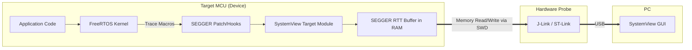

# SEGGER SystemView Guide for FreeRTOS

## 1. What is SEGGER SystemView?
SEGGER SystemView is a powerful software toolkit used to analyze the runtime behavior of embedded software running on your target MCU. It works with both RTOS-based applications (like FreeRTOS) and non-OS bare-metal applications.

SystemView acts as an "x-ray" for your embedded code. It sheds light on exactly what happened and in what order.

**Why use SystemView with FreeRTOS?**
- **Task Analysis**: See how many tasks are running and exactly how much CPU time they consume.
- **ISR Profiling**: Measure Interrupt Service Routine (ISR) entry/exit timings and execution duration.
- **Task Behavior**: Observe task state changes (Blocking, Unblocking, Yielding, Notifying).
- **Power Optimization**: Analyze CPU Idle time to determine when the CPU can be put into sleep mode.
- **Debugging**: Identify inefficient code, superfluous/spurious interrupts, and unexpected task context switches.

### Key Terms and Abbreviations
Before diving deeper, let's clarify some common acronyms used in this guide:
- **MCU (Microcontroller Unit)**: The chip you are programming (e.g., STM32).
- **RTOS (Real-Time Operating System)**: The operating system managing your tasks (e.g., FreeRTOS).
- **RTT (Real Time Transfer)**: A proprietary technology by SEGGER that allows extremely high-speed communication between the MCU and the PC. Unlike UART/Serial which is slow and blocks the CPU, RTT reads/writes directly from/to the MCU's RAM using the debug probe, causing almost zero overhead.
- **SWD (Serial Wire Debug)**: A 2-pin hardware interface designed by ARM for programming and debugging microcontrollers. It is the physical wire used by the J-Link probe to read the RTT buffer.
- **ISR (Interrupt Service Routine)**: A hardware-triggered function (e.g., timer tick, button press) that interrupts the normal CPU flow.
- **DWT_CYCCNT (Data Watchpoint and Trace Cycle Count)**: A hardware register inside ARM Cortex processors that increments by 1 for every single CPU clock tick. It acts as an ultra-precise stopwatch.

## 2. The SystemView Toolkit Components
The toolkit consists of two main parts working together:
1. **PC Visualization Software (Host)**: The SystemView software running on your Windows, Linux, or Mac PC.
2. **SystemView Target Sources (Device)**: Small C code modules compiled into your target MCU project to collect events and send them back to the PC.

### SystemView Architecture Layers
Here is how the data flows from your FreeRTOS application to your PC screen:


*Notice how SystemView does not use a slow UART port. It reads the RTT buffer directly from RAM using the SWD (Serial Wire Debug) hardware interface, resulting in almost zero CPU overhead!*

### Required Tools to Download:
To get started, you need to download:
1. SEGGER SystemView software (PC Host).
2. SEGGER SystemView target source file.
3. SEGGER ST-Link Reflash utility (If using ST-Link).
4. SEGGER J-Link software package V5.12b or later.
5. SystemView User Manual.

---

## 3. Visualization Modes

### A. Real-Time Recording (Continuous)
SystemView continuously records data on the target, streams it to the PC, and visualizes it live.
- Requires a **SEGGER J-Link** debugger utilizing Real Time Transfer (RTT) technology.
- *Tip:* You can achieve this with a standard **ST-Link** (found on STM32 Nucleo/Discovery boards) by flashing it with J-Link firmware using the SEGGER ST-Link Reflash utility.

**Communication Layers: Target System <-> J-Link <-> Host System (PC)**
The magic of real-time recording lies in how the layers interact without halting the CPU:

```mermaid
sequenceDiagram
    participant App as Target MCU (RAM)
    participant JLink as J-Link Debug Probe
    participant PC as Host System (PC)

    Note over App, PC: REAL-TIME RECORDING COMMUNICATION LAYERS
    
    rect rgb(40, 40, 40)
    Note over App: Layer 1: Data Generation
    App->>App: 1. FreeRTOS fires Context Switch
    App->>App: 2. SystemView formats event packet
    App->>App: 3. Writes packet to RTT Up-Buffer (RAM)
    end
    
    rect rgb(60, 40, 40)
    Note over App, JLink: Layer 2: Hardware Transport (SWD/JTAG)
    loop Continuous Background Polling
        JLink->>App: 4. Read RTT Buffer via Background Memory Access (SWD)
        App-->>JLink: 5. Return Raw Buffer Data
    end
    end
    
    rect rgb(40, 60, 40)
    Note over JLink, PC: Layer 3: PC Interface (USB)
    JLink->>PC: 6. Stream raw data over USB
    end
    
    rect rgb(60, 40, 60)
    Note over PC: Layer 4: Visualization
    PC->>PC: 7. J-Link driver parses RTT protocol
    PC->>PC: 8. SystemView Host App renders Timeline GUI
    end
```



### B. Single-Shot Recording
Data is recorded until the target buffer is full, and then execution stops recording.
- You do **not** need a J-Link or ST-Link debugger actively connected to stream data.
- The recording is started manually in the code.
- Useful for capturing a specific point of interest in your application without constant streaming overhead.

---

## 4. Target Integration: Step-by-Step Guide

Follow these steps to integrate SystemView into your FreeRTOS project.

### Step 1: Adding Target Sources
1. Download the SystemView target sources and extract them.
2. Create folders in your FreeRTOS project and add the extracted files.
3. Configure your IDE's Include Paths so the compiler can find the SEGGER header files.
*Note: If you are using FreeRTOS v11 (or later) and SystemView Target Source v3.54 (or later), you do not need to apply the patch file.*

### Step 2: Patching FreeRTOS (Older Versions Only)
If you are using older versions of FreeRTOS, you must apply the provided SEGGER patch file to the FreeRTOS core files to hook the trace macros into the RTOS kernel.

### Step 3: Configuring `FreeRTOSConfig.h`
You must add specific configurations to your `FreeRTOSConfig.h` file.

1. **Include the SystemView header**: This must be included at the end of `FreeRTOSConfig.h` (but above any inclusion of `FreeRTOS.h`). It defines the trace macros required to generate SystemView events.
   ```c
   #include "SEGGER_SYSVIEW_FreeRTOS.h"
   ```
2. **Enable required macros**: SystemView requires these macros to access specific FreeRTOS variables.
   ```c
   #define INCLUDE_xTaskGetIdleTaskHandle 1
   #define INCLUDE_pxTaskGetStackStart    1
   ```

### Step 4: MCU and Project Specific Settings
Configure the SystemView files for your specific hardware. Open `SEGGER_SYSVIEW_ConfDefaults.h`:

1. **Processor Core**: Define which MCU core you are using (Cortex-M3, M4, M7, etc.).
   ```c
   // Example for an STM32F4 (Cortex-M4)
   #define SEGGER_SYSVIEW_CORE SEGGER_SYSVIEW_CORE_CM3 
   ```
2. **Buffer Size**: Configure the RTT buffer size. Larger buffers prevent event loss but consume RAM.
   ```c
   // Example: Allocating 1024 bytes for the RTT trace buffer
   #define SEGGER_SYSVIEW_RTT_BUFFER_SIZE 1024
   ```
3. **Application Info**: Open `SEGGER_SYSVIEW_Config_FreeRTOS.c` and configure your exact CPU frequency. SystemView needs this to calculate timings in microseconds/milliseconds.
   ```c
   #define SYSVIEW_RAM_BASE        (0x20000000) // Start of RAM
   // Configure your actual CPU Clock, e.g., 168 MHz
   static void _cbSendSystemDesc(void) {
     SEGGER_SYSVIEW_SendSysDesc("N="SYSVIEW_APP_NAME",O=FreeRTOS,M="SYSVIEW_DEVICE_NAME);
     SEGGER_SYSVIEW_SendSysDesc("I#15=SysTick");
   }
   ```

### Step 5: Enable ARM Cortex Cycle Counter (DWT_CYCCNT)
SystemView requires precise timestamps to track application events accurately. On ARM Cortex-M3/M4 processors, it uses the **DWT_CYCCNT** (Data Watchpoint and Trace Cycle Count) register.
- This register stores the exact number of clock cycles that have passed since the processor's reset.
- By default, this register is disabled. You must enable it.
- **Hardware Address**: `0xE0001000` (Access: Read/Write, Reset State: `0x40000000`).

### Step 6: Start Recording Events
Initialize and start the SystemView recording from your `main.c` function before launching the FreeRTOS Scheduler.

```c
int main(void)
{
    // MCU initialization code...
    
    // Initialize SystemView
    SEGGER_SYSVIEW_Conf();
    
    // Start Recording Events
    SEGGER_SYSVIEW_Start(); // SystemView events recording starts ONLY when you call this
    
    // Create your tasks here...
    
    // Start Scheduler
    vTaskStartScheduler();
    
    while(1);
}
```

### Step 7: Compile and Debug
1. Ensure all include paths are properly set in your IDE.
2. Compile and flash your FreeRTOS + SystemView application to the MCU.
3. Enter Debugging mode using your IDE.
4. Hit Run, let the code execute for a couple of seconds, and then pause it.

### Step 8: Collect the Recorded Data (Single-Shot Mode)
If you are using Single-Shot recording (without live RTT streaming), you must manually extract the buffer:
1. While paused in the debugger, find the memory addresses for the SystemView RTT buffer. Usually these variables hold the info:
   - Buffer Address: `_SEGGER_RTT.aUp[1].pBuffer`
   - Bytes Used: `_SEGGER_RTT.aUp[1].WrOff`
2. Take a memory dump of this address region to a file on your PC.
3. Save the file with the `.SVDAT` extension.
4. Open the SystemView Host software and load the `.SVDAT` file.

---
## 5. Analyzing the Trace
Once loaded into the SystemView Host application, you can visually analyze the timeline. SystemView is incredible for analyzing and proving whether your system is truly running Cooperative Scheduling or Pre-emptive Scheduling, showing exactly when interrupts fire and tasks yield the CPU!

---
## 6. Tracing Custom Events (Example)
SystemView tracks RTOS tasks automatically, but you can also trace your own custom events in `main.c` or your task functions. This is very useful for profiling how long a specific algorithm takes.

**Example: Measuring Algorithm Time**
```c
#include "SEGGER_SYSVIEW.h"

#define MY_CUSTOM_EVENT_ID  33

void vTask1_handler(void *pvParameters)
{
    while(1)
    {
        // 1. Mark the start of the event
        SEGGER_SYSVIEW_RecordVoid(MY_CUSTOM_EVENT_ID);
        
        // 2. Run heavy algorithm
        RunHeavyMathCalculation();
        
        // 3. Mark the end of the event
        SEGGER_SYSVIEW_RecordEndCall(MY_CUSTOM_EVENT_ID);
        
        vTaskDelay(10);
    }
}
```
In the SystemView timeline, you will now see a marker for `Event 33` showing exactly how many microseconds `RunHeavyMathCalculation()` took.

## 7. Official Documentation & How to Study It
To truly master this tool, reading the official documentation is highly recommended. The PDF files are included when you download the Host Software.

1. **`UM08027_SystemView.pdf` (SystemView User Manual)**:
   - **Where to find it**: In the installation directory of SystemView (e.g., `C:\Program Files\SEGGER\SystemView\Doc`).
   - **What to read**: Look at the "Target Implementation" chapter to understand how events are formulated, and the "User Interface" chapter to learn how to measure distances (time) between two events in the GUI.
2. **`UM08001_JLink.pdf` (J-Link User Guide)**:
   - **Why read this?** SystemView relies heavily on SEGGER's RTT (Real Time Transfer) technology. Read the "RTT" chapter to understand how the debugger reads the RAM buffer without halting the CPU.
3. **FreeRTOS Trace Macros Documentation**:
   - Visit the official FreeRTOS website and read about `configUSE_TRACE_FACILITY`. SystemView is basically hooking into these native FreeRTOS macros (`traceTASK_SWITCHED_IN()`, `traceTASK_SWITCHED_OUT()`, etc.) to generate its data.
