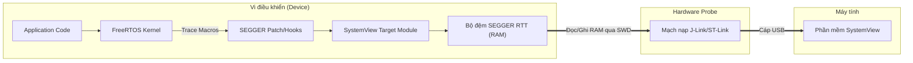

# Hướng dẫn sử dụng SEGGER SystemView cho FreeRTOS

## 1. SEGGER SystemView là gì?
SEGGER SystemView là một bộ công cụ phần mềm mạnh mẽ dùng để phân tích hành vi của phần mềm nhúng đang chạy trên vi điều khiển (MCU) của bạn. Nó hoạt động tốt với cả các ứng dụng dùng hệ điều hành thời gian thực (RTOS như FreeRTOS) hoặc các ứng dụng Bare-metal (không dùng hệ điều hành).

SystemView đóng vai trò như một máy "chụp X-quang" cho code nhúng. Nó làm sáng tỏ chính xác chuyện gì đang xảy ra bên trong vi điều khiển và theo thứ tự nào.

**Tại sao nên dùng SystemView với FreeRTOS?**
- **Phân tích Task**: Xem có bao nhiêu task đang chạy và chúng tiêu tốn chính xác bao nhiêu thời gian của CPU.
- **Phân tích Ngắt (ISR)**: Đo lường thời gian bắt đầu, kết thúc và tổng thời gian thực thi của các trình phục vụ ngắt (ISR).
- **Hành vi của Task**: Quan sát các trạng thái của task (Bị block, Unblock, Nhường CPU - Yielding, Notifying...).
- **Tối ưu năng lượng**: Phân tích thời gian rảnh (Idle time) của CPU để quyết định khi nào đưa CPU vào chế độ ngủ (Sleep mode).
- **Tìm lỗi (Debugging)**: Phát hiện các đoạn code kém hiệu quả, các ngắt bị gọi thừa thãi (spurious interrupts), hoặc các sự kiện chuyển đổi task (Context Switch) không mong muốn.

### Các thuật ngữ và từ viết tắt (Glossary)
Trước khi đi sâu hơn, hãy làm rõ một số thuật ngữ thường gặp trong tài liệu này:
- **MCU (Microcontroller Unit)**: Vi điều khiển hay con chip mà bạn đang lập trình (Ví dụ: STM32).
- **RTOS (Real-Time Operating System)**: Hệ điều hành thời gian thực quản lý các task của bạn (Ví dụ: FreeRTOS).
- **RTT (Real Time Transfer)**: Công nghệ truyền tải thời gian thực độc quyền của SEGGER. Khác với cổng UART rất chậm và hay làm nghẽn CPU, RTT cho phép đọc/ghi dữ liệu **trực tiếp vào RAM** của vi điều khiển thông qua mạch nạp với tốc độ cực cao, gần như không tốn chút tài nguyên CPU nào.
- **SWD (Serial Wire Debug)**: Chuẩn giao tiếp phần cứng 2 dây do ARM phát triển để nạp code và debug. Đây chính là đường dây vật lý mà mạch nạp J-Link dùng để hút dữ liệu RTT từ RAM ra ngoài.
- **ISR (Interrupt Service Routine)**: Trình phục vụ ngắt. Là các hàm phần cứng (ví dụ: ngắt timer, ngắt nút nhấn) buộc CPU phải tạm dừng việc đang làm để xử lý ngay lập tức.
- **DWT_CYCCNT (Data Watchpoint and Trace Cycle Count)**: Một thanh ghi phần cứng đặc biệt bên trong nhân ARM Cortex. Nó đếm tăng lên 1 đơn vị ứng với mỗi một chu kỳ dao động (clock tick) của CPU. Nó đóng vai trò như một chiếc đồng hồ bấm giờ siêu chính xác.

## 2. Các thành phần của SystemView Toolkit
Bộ công cụ bao gồm 2 thành phần chính hoạt động song song:
1. **Phần mềm hiển thị trên PC (Host)**: Cài đặt trên máy tính Windows, Linux, hoặc Mac.
2. **Mã nguồn SystemView cho Target (Device)**: Một bộ mã nguồn C nhỏ gọn được biên dịch chung với project vi điều khiển của bạn để thu thập sự kiện và gửi về PC.

### Mô hình các lớp (Architecture Layers)
Dưới đây là sơ đồ mô tả cách dữ liệu chảy từ ứng dụng FreeRTOS của bạn lên màn hình máy tính:


*Hãy chú ý: SystemView KHÔNG sử dụng cổng UART (vì UART rất chậm). Thay vào đó, mạch nạp J-Link dùng giao diện SWD phần cứng để đọc trực tiếp bộ đệm RTT từ RAM trong lúc CPU đang chạy, giúp tiết kiệm gần như 100% tài nguyên CPU!*

### Các công cụ cần tải xuống:
1. Phần mềm SEGGER SystemView (PC Host).
2. Mã nguồn SEGGER SystemView Target.
3. Tiện ích SEGGER ST-Link Reflash (Nếu bạn dùng mạch nạp ST-Link).
4. Gói phần mềm SEGGER J-Link bản V5.12b trở lên.
5. Tài liệu hướng dẫn sử dụng (User Manual) của SystemView.

---

## 3. Các chế độ hiển thị (Visualization Modes)

### A. Ghi dữ liệu thời gian thực (Real-Time Recording)
SystemView liên tục ghi nhận dữ liệu trên vi điều khiển, truyền về PC và vẽ biểu đồ ngay lập tức (live streaming).
- **Yêu cầu**: Phải có mạch nạp/gỡ lỗi **SEGGER J-Link** hỗ trợ công nghệ RTT (Real Time Transfer).
- *Mẹo:* Bạn có thể sử dụng mạch nạp **ST-Link** có sẵn trên các board STM32 Nucleo/Discovery bằng cách "flash" lại firmware của J-Link lên ST-Link thông qua công cụ "SEGGER ST-Link Reflash utility".

**Các Lớp Giao Tiếp (Communication Layers): Target System <-> J-Link <-> Host System (PC)**
Sự kỳ diệu của việc ghi thời gian thực nằm ở cách các lớp tương tác với nhau mà hoàn toàn không làm đứng CPU:

```mermaid
sequenceDiagram
    participant App as Target MCU (RAM)
    participant JLink as Mạch nạp J-Link
    participant PC as Máy tính (Host PC)

    Note over App, PC: CÁC LỚP GIAO TIẾP GHI DỮ LIỆU THỜI GIAN THỰC
    
    rect rgb(40, 40, 40)
    Note over App: Lớp 1: Khởi tạo Dữ liệu
    App->>App: 1. FreeRTOS kích hoạt Context Switch
    App->>App: 2. SystemView đóng gói sự kiện
    App->>App: 3. Ghi gói tin vào RTT Up-Buffer trên RAM
    end
    
    rect rgb(60, 40, 40)
    Note over App, JLink: Lớp 2: Truyền tải Phần cứng (SWD/JTAG)
    loop Quét nền liên tục (Background Polling)
        JLink->>App: 4. Đọc RTT Buffer thông qua tính năng truy cập RAM ẩn (SWD)
        App-->>JLink: 5. Trả về dữ liệu thô
    end
    end
    
    rect rgb(40, 60, 40)
    Note over JLink, PC: Lớp 3: Giao diện máy tính (USB)
    JLink->>PC: 6. Truyền dữ liệu thô qua cáp USB
    end
    
    rect rgb(60, 40, 60)
    Note over PC: Lớp 4: Hiển thị trực quan
    PC->>PC: 7. Driver J-Link giải mã giao thức RTT
    PC->>PC: 8. Phần mềm SystemView vẽ biểu đồ Timeline
    end
```



### B. Ghi dữ liệu một lần (Single-Shot Recording)
Dữ liệu được ghi và lưu vào một bộ đệm (buffer) trên RAM của vi điều khiển cho đến khi bộ đệm đầy thì hệ thống sẽ dừng ghi.
- **Không yêu cầu** mạch nạp J-Link hay ST-Link phải kết nối liên tục.
- Quá trình ghi được kích hoạt thủ công bằng code trong ứng dụng.
- Rất hữu ích khi bạn chỉ muốn chụp lại (capture) một đoạn sự kiện cụ thể đang được quan tâm.

---

## 4. Tích hợp SystemView vào Project: Hướng dẫn từng bước

Làm theo các bước sau để tích hợp SystemView vào project FreeRTOS của bạn.

### Bước 1: Thêm file mã nguồn (Target Sources)
1. Tải và giải nén thư mục mã nguồn SystemView Target.
2. Tạo thư mục trong project FreeRTOS của bạn và chép các file vào đó.
3. Cài đặt đường dẫn (Include Paths) trong IDE để trình biên dịch có thể tìm thấy các file header (`.h`) của SEGGER.
*Lưu ý: Nếu bạn đang dùng FreeRTOS bản v11 (trở lên) và SystemView Target Source bản v3.54 (trở lên), bạn **không cần** phải cài file bản vá (patch file).*

### Bước 2: Vá lỗi FreeRTOS (Chỉ dành cho bản cũ)
Nếu dùng phiên bản FreeRTOS cũ, bạn phải dùng file patch do SEGGER cung cấp để chèn các macro theo dõi (trace macros) vào bên trong file mã nguồn gốc của FreeRTOS.

### Bước 3: Cấu hình `FreeRTOSConfig.h`
Bạn cần bổ sung các cấu hình sau vào file `FreeRTOSConfig.h`.

1. **Thêm thư viện SystemView**: Phải đặt ở **cuối cùng** của file `FreeRTOSConfig.h` (nhưng nằm phía trên mọi dòng `#include "FreeRTOS.h"` nếu có). File này sẽ định nghĩa các macro cần thiết để tạo sự kiện SystemView.
   ```c
   #include "SEGGER_SYSVIEW_FreeRTOS.h"
   ```
2. **Bật các Macro bắt buộc**:
   ```c
   #define INCLUDE_xTaskGetIdleTaskHandle 1
   #define INCLUDE_pxTaskGetStackStart    1
   ```

### Bước 4: Cài đặt thông số cho MCU và Project
Cấu hình các file của SystemView cho phù hợp với phần cứng của bạn. Hãy mở file `SEGGER_SYSVIEW_ConfDefaults.h`:

1. **Khai báo Core CPU**: Khai báo loại nhân vi điều khiển (Cortex-M3, M4, M7, v.v.).
   ```c
   // Ví dụ cho STM32F4 (Cortex-M4)
   #define SEGGER_SYSVIEW_CORE SEGGER_SYSVIEW_CORE_CM3 
   ```
2. **Kích thước Buffer**: Cài đặt dung lượng bộ nhớ đệm RTT. Bộ đệm lớn giúp tránh mất mát sự kiện (event loss) nhưng sẽ tốn RAM.
   ```c
   // Ví dụ: Cấp phát 1024 bytes làm bộ đệm ghi sự kiện
   #define SEGGER_SYSVIEW_RTT_BUFFER_SIZE 1024
   ```
3. **Thông tin ứng dụng**: Mở file `SEGGER_SYSVIEW_Config_FreeRTOS.c` và khai báo chính xác tốc độ CPU (CPU Clock). SystemView cần con số này để tính toán chính xác thời gian (microseconds).
   ```c
   #define SYSVIEW_RAM_BASE        (0x20000000) // Địa chỉ bắt đầu của RAM
   // Hàm gửi thông tin cấu hình phần cứng
   static void _cbSendSystemDesc(void) {
     SEGGER_SYSVIEW_SendSysDesc("N="SYSVIEW_APP_NAME",O=FreeRTOS,M="SYSVIEW_DEVICE_NAME);
     SEGGER_SYSVIEW_SendSysDesc("I#15=SysTick");
   }
   ```

### Bước 5: Kích hoạt bộ đếm chu kỳ ARM Cortex (Cycle Counter)
SystemView cần biết mốc thời gian (timestamp) cực kỳ chính xác cho các sự kiện. Trên kiến trúc ARM Cortex-M3/M4, nó sử dụng thanh ghi **DWT_CYCCNT** (Data Watchpoint and Trace Cycle Count).
- Thanh ghi này đếm chính xác số chu kỳ xung nhịp CPU đã trôi qua kể từ khi vi điều khiển được reset.
- Mặc định, thanh ghi này bị **vô hiệu hóa**. Bạn phải bật nó lên.
- **Thông tin phần cứng**: Địa chỉ `0xE0001000` (Quyền Truy cập: Read/Write, Trạng thái Reset: `0x40000000`).

### Bước 6: Bắt đầu ghi sự kiện
Khởi tạo và chạy bộ ghi của SystemView trong hàm `main.c` trước khi gọi hàm khởi động Scheduler của FreeRTOS.

```c
int main(void)
{
    // Code khởi tạo MCU...
    
    // Khởi tạo SystemView
    SEGGER_SYSVIEW_Conf();
    
    // Bắt đầu ghi sự kiện (Quá trình ghi CHỈ bắt đầu khi hàm này được gọi)
    SEGGER_SYSVIEW_Start();
    
    // Khởi tạo các task ở đây...
    
    // Khởi động RTOS Scheduler
    vTaskStartScheduler();
    
    while(1);
}
```

### Bước 7: Biên dịch và chạy Debug
1. Đảm bảo cấu hình đường dẫn (include paths) trên IDE đã chính xác.
2. Biên dịch (Compile) và nạp firmware (Flash) vào vi điều khiển.
3. Bật chế độ Debug trên IDE của bạn.
4. Bấm Run, để chương trình chạy vài giây rồi bấm Pause (Tạm dừng).

### Bước 8: Thu thập dữ liệu đã ghi (Chế độ Single-Shot)
Nếu bạn ghi dữ liệu theo kiểu Single-Shot (không stream trực tiếp qua J-Link RTT), bạn phải lấy dữ liệu thủ công:
1. Khi chương trình đang tạm dừng trong chế độ Debug, hãy tìm địa chỉ của bộ đệm RTT trong RAM. Thông thường nằm ở các biến:
   - Địa chỉ bắt đầu Buffer: `_SEGGER_RTT.aUp[1].pBuffer`
   - Số byte đã ghi: `_SEGGER_RTT.aUp[1].WrOff`
2. Trích xuất (Memory Dump) vùng nhớ này và lưu thành một file trên máy tính.
3. Đổi đuôi file đó thành `.SVDAT`.
4. Mở phần mềm SystemView Host trên PC và Load file `.SVDAT` đó vào.

---
## 5. Phân tích kết quả (Trace Analysis)
Sau khi nạp dữ liệu vào phần mềm SystemView Host, bạn sẽ thấy một bản đồ thời gian (Timeline) cực kỳ trực quan. SystemView là công cụ tuyệt vời để phân tích và chứng minh xem hệ thống của bạn có thực sự đang chạy Lập lịch hợp tác (Cooperative Scheduling) hay không, chỉ ra chính xác thời điểm các ngắt xảy ra và task nào đang chiếm/nhường CPU!

---
## 6. Theo dõi các sự kiện tùy chỉnh (Ví dụ)
Mặc định, SystemView sẽ tự động theo dõi các sự kiện của FreeRTOS. Tuy nhiên, bạn hoàn toàn có thể tự bắn ra các sự kiện của riêng bạn (Custom Events) để đo lường. Điều này rất hữu ích để đo lường thời gian chạy của một thuật toán.

**Ví dụ: Đo lường thời gian chạy thuật toán**
```c
#include "SEGGER_SYSVIEW.h"

#define MY_CUSTOM_EVENT_ID  33

void vTask1_handler(void *pvParameters)
{
    while(1)
    {
        // 1. Đánh dấu thời điểm BẮT ĐẦU sự kiện
        SEGGER_SYSVIEW_RecordVoid(MY_CUSTOM_EVENT_ID);
        
        // 2. Chạy thuật toán tính toán nặng nề
        RunHeavyMathCalculation();
        
        // 3. Đánh dấu KẾT THÚC sự kiện
        SEGGER_SYSVIEW_RecordEndCall(MY_CUSTOM_EVENT_ID);
        
        vTaskDelay(10);
    }
}
```
Khi mở bản đồ Timeline trên máy tính, bạn sẽ thấy cột mốc `Event 33` hiển thị, và bạn có thể click vào để xem thuật toán `RunHeavyMathCalculation()` mất chính xác bao nhiêu micro-giây để chạy xong!

## 7. Tài liệu chính thức và Cách nghiên cứu chuyên sâu
Để thực sự làm chủ công cụ này, bạn phải biết tìm đọc tài liệu ở đâu. Khi cài đặt phần mềm Host lên máy tính, SEGGER đã đính kèm sẵn các file PDF gốc.

1. **Tài liệu `UM08027_SystemView.pdf` (User Manual)**:
   - **Tìm ở đâu**: Nằm trong thư mục cài đặt phần mềm (Ví dụ: `C:\Program Files\SEGGER\SystemView\Doc`).
   - **Nên đọc gì**: Hãy tìm đọc chương "Target Implementation" để hiểu cách các API của SystemView hoạt động. Đọc chương "User Interface" để học cách sử dụng chuột để đo đạc khoảng cách thời gian giữa 2 sự kiện trên giao diện GUI.
2. **Tài liệu `UM08001_JLink.pdf` (J-Link User Guide)**:
   - **Tại sao nên đọc?** SystemView dựa hoàn toàn vào công nghệ RTT (Real Time Transfer). Đọc chương "RTT" sẽ giúp bạn giác ngộ cách J-Link luồn lách qua phần cứng SWD để lấy dữ liệu RAM mà không cần CPU phải tạm dừng (halt).
3. **Tài liệu về Trace Macros của FreeRTOS**:
   - Lên trang chủ FreeRTOS.org, tìm kiếm về từ khóa `configUSE_TRACE_FACILITY`. Bản chất SystemView hoạt động dựa trên việc cắm các "móc câu" (hooks) vào các macro có sẵn của FreeRTOS như `traceTASK_SWITCHED_IN()`, `traceTASK_SWITCHED_OUT()` để báo cáo về PC.
